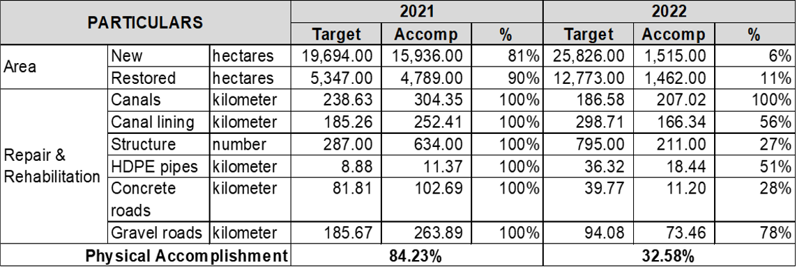

# National Irrigation Administration (NIA)

## What is the status of irrigation development in the Philippines?

- As of December 31, 2021, developed irrigation areas reached 2.04 million hectares, or equivalent to 65.28% of the total estimated area. 
- Specifically for the period of 2016-2021, there was an increase of 186,411 ha (or 6%) on areas developed for irrigation, with an average increase of 1.2% (37,282 ha) per year.
- The nationwide irrigation development breakdown as of 2021 is as follows:

## What is the National Irrigation Master Plan 2020 – 2030?

- The NIMP 2020–2030 will serve as a national reference guide of irrigation agencies and stakeholders.
- The 10-year master plan aims to achieve food security and poverty reduction with accelerated and sustained irrigation development under diversified crop production systems. 
- A total of 681,709 hectares of new irrigated areas are targeted to be generated within 2020-2030 according to the Plan.
- Under the NIMP, the estimated investment requirement for 2020-2030 amounting to PhP 561 billion will be distributed as follows:
  - NIA: PhP 337 billion;
  - LGU: PhP 195 billion; and
  - OGA: PhP 29 billion
- What is the status of project implementation of irrigation programs for the past 2 years?
- As of July 2022, the physical performances of the FY 2021 and 2022 programs are at 84.23% and 32.58%, respectively (refer to the table below). These were affected mainly by the enhanced community quarantine imposed during the pandemic.

## What are the updates on the Free Irrigation Service Act (FISA)?

- FISA serves as subsidy incentive for Irrigators’ Associations (IAs) for taking over Operation and Maintenance management responsibilities. The amount of incentives vary, as follows:
  - For operations incentive: PhP 150 per hectare per cropping of validated area planted.
  - For maintenance incentive:  PhP 2,800 per canal section per maintenance period (every 45 days, maximum of 6 times in a year).
- As of July 2022, there are about 1,047,133 small farmers nationwide  in National and Communal Irrigation Systems (NIS/CIS) who benefitted from FISA, covering a total of 1.21 million hectares of irrigated lands.
  - From these figures, there are:
    - 666,156 farmers served by NIS cultivating an aggregate area of 768,336.20 hectares; and
    - 380,977 farmers served by CIS cultivating an aggregate area of 445,962.21 hectares.

## What is the status of NIA’s flagship projects? (as of July 31, 2022)

- Balog-Balog Multipurpose Project Phase II
  - Implementation Schedule: 2013-2025
  - Location: Tarlac
  - Target Area: 17,890 ha
  - Accomplishment: 53.30%  
- Jalaur River Multipurpose Project Stage II (JRMP II)
  - Implementation Schedule: 2019-2024
  - Location: Iloilo
  - Target Area: New: 9,500 ha, Rehab: 22,340 ha
  - Farmer Beneficiaries: New: 7,106 farmers, Rehab: 18,782 farmers
  - Accomplishment: 43.98%
- Malitubog – Maridagao Irrigation Project Stage II
  - Implementation Schedule: 2012-2022
  - Location: Maguindanao and North Cotabato
  - Target Area: 9,784 ha
  - Accomplishment: 81.74%
- Lower Agno River Irrigation System Improvement Project
  - Implementation Schedule: 2018-2022
  - Location: Pangasinan, Tarlac, Nueva Ecija
  - Target Area: New: 7, 519 ha, Restored: 1, 786 ha
  - Accomplishment: 86.30%  
- Chico River Pump Irrigation Project (CRPIP)
  - Implementation Schedule: 2017-2022
  - Location: Cagayan
  - Target Area: New: 8,700 ha
  - Farmer Beneficiaries: 4,350 farmers
  - Accomplishment: 90.38%
