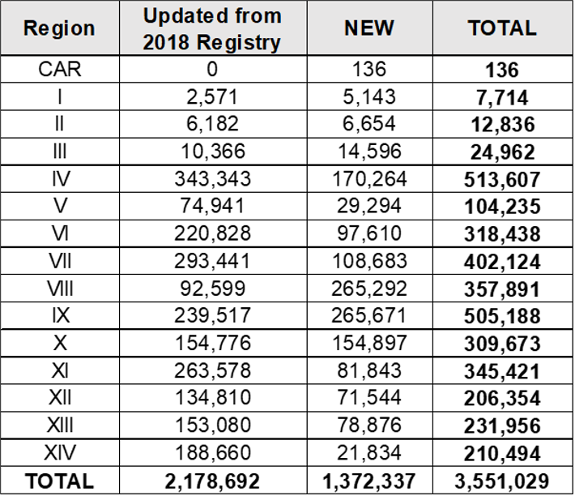

# Philippine Coconut Authority (PCA)

## What is the status of the National Coconut Farmers Registry System (NCFRS)?

- As of September 15, 2022, there are about 3.55 million farmers entered in the Registry, comprising of 2.18 million names that were migrated from the 2018 registry and an additional 1.37 million new registrants. These are being subjected to deduplication, delisting, and verification.

## What are the requirements and application procedures to be registered in the NCFRS?

- The documentary requirements for the NCFRS Registration are the following: 
  - Accomplished NCFRS Registration Form;
  - Photocopy of any government issued ID; and
  - Photocopy of land title, certification of lease of land, or any legal document on land ownership.
- The coconut farmers and farm workers may register through the following:
  - Mass/Caravan Registrations;
  - Walk-in in their respective LGUs/PCA Offices;
  - Online through the NCFRS Website; and
  - Registration through PCA partners.

