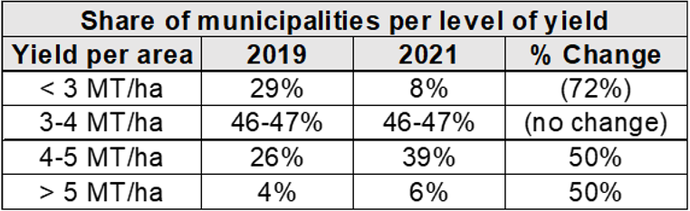
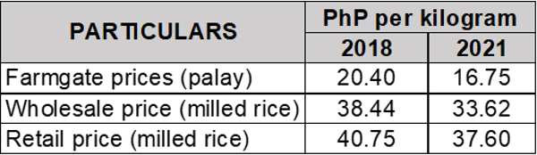

# Philippine Rice Research Institute (PhilRice)

## What is the current status of the Philippine Rice Industry?

- Prevalence of generally favorable conditions provided ample room for palay and milled rice production growth in the country:

- The share of municipalities with yields more than 3 MT/ha also increased from 2019-2021 (see below):

- At 65.4% milling recovery rate, the 19.96 million MT of palay in 2021 produced 13.05 million MT of milled rice (bigas). 
- Despite sustained increases in the annual production of rice since 2016, domestic rice production is still not enough due to continued increase in local demand. Current self-sufficiency ratio in local rice production stands at 85% in 2020.
- The Rice Tariffication Law (RA 11203) lifted the quantitative restriction on rice imports. This resulted in total milled rice imports of 2.97 million MT for 2021, leading to hefty beginning stocks of 2.38 million MT in 2022.
- Farmgate, wholesale, and retail prices of rice continued to contract from 2018 to 2021:

## What is the current demand level for rice?

- Rice demand increased from 12.13 million MT in 2016 to 16.03 million MT in 2021. 
- Increase in total demand is driven by increase in food demand. This is a direct result of population growth which is at 1.35% annual average. The net per capita rice available for food rose from 108 kg/person/year in 2016 to 130 kg/person/year in 2021.
- Based on the latest outlook as of August 31, 2022, rice demand is projected to be at 15.1 million MT for the whole year of 2022. This demand is distributed over food use (89.6%), feeds and waste (5.5%), processing (3.4%), and seed use (1.5%).

## What is the current cost of palay production?

- The cost of producing palay per hectare soared as price of inputs grew. Production cost rose from PhP 42,708/ha in 2016 to PhP 47,089/ha in 2020.
- With the spiraling prices of fertilizers and fuel in 2022 brought about by the Russia-Ukraine war, production cost is estimated to increase up to almost PhP 56,000/ha.
- While yield climbed up, income from rice production fell from PhP 24,719/ha in 2016 to PhP 21,430/ha in 2020.
