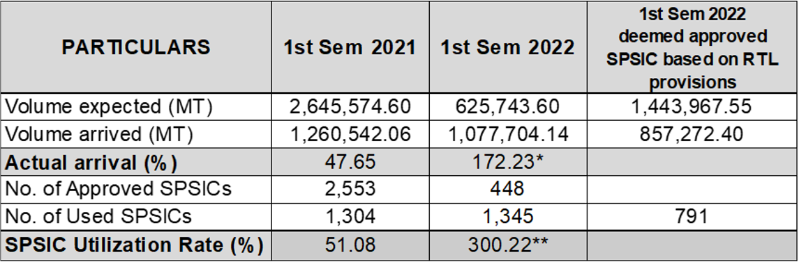

# Bureau of Plant Industry (BPI)

## What are the updates on the importation of rice, garlic, and onion?

<u>Rice</u>

In the first semester of 2022, a total of 1.93 million MT of imported rice arrived in the country from import clearances issued this year and in the previous year. Also included are arrivals from those who invoked the provision of the RTL.

\* Includes carry over from the approved SPSIC issued in the previous year

\** High utilization rate can be observed since there was no issuance of SPSIC during the 1st and 2nd quarters of 2022.

<u>Onion</u>

- As of August 4, 2022, a total volume of 7,921.737 MT of fresh yellow onion (covered by the SPSIC issuance from Sept. 29 to Nov. 1, 2021), and 21,785.784 MT of fresh red onion (from the SPSIC issuance from Nov. 27-30, 2021) have been imported in the country.

<u>Garlic</u>

- As of August 4, 2022, a total of 2,513 SPSICs were issued by BPI for the importation of garlic. 
- From these SPSICs, only 54.20% (or 1,362 clearances) were used for the 1st semester of 2022.
- The country has imported a total of 57,246 MT garlic, or 45.78% of the total 125,054 MT expected volume as per applied SPSICs. 

## What are the future plans of BPI to address smuggling of agricultural goods?

- BPI intends to enter into a Memorandum of Agreement (MOA) with concerned agencies to establish a system on filing cases against importers that deliberately committed violations so that their License to Operate (LTOs) can be revoked by the BPI;
- Concerned DA Regulatory Agencies will establish close coordination for all interceptions and disposal of smuggled agricultural products conducted by the Bureau of Customs (BOC) since this is part of the agreements under the Customs Memorandum Order No. 4-2007; and
- DA shall also request the BOC for:
  - More regular DA-BOC inter-agency operations at domestic shipyards to address commodities which were reported to illegally enter and are transported to different parts of the country via domestic route;
  - Full authority to confiscate smuggled agricultural products upon confirmation by the concerned DA regulatory agency; and 
  - Inclusion of other food stuff in the inspections being conducted by DA Regulatory Agencies.
