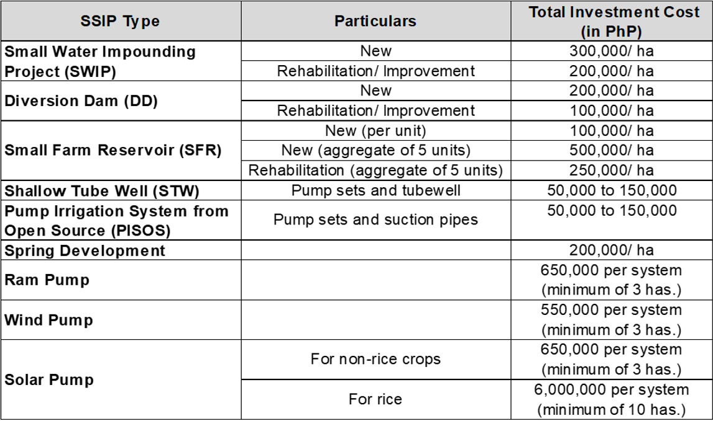

# Bureau of Soils and Water Management (BSWM)

## What is the status of implementation of the Small Water Irrigation System?

- As of December 2021, a total of 20,507 units of Small-Scale Irrigation Projects (SSIPs) were implemented covering a total of 168,290 hectares. These are for the benefit of 2,704 Small Water Irrigation System Association (SWISAs) and Farmers’ Association (FAs) nationwide with a total of 84,341 members.

## What is the investment cost per type of Small-Scale Irrigation Project (SSIP)?

## Why are solar-powered pumps expensive? 

- The high cost of solar panels is the primary reason for the high price of solar-powered pumps, accounting for up to 60% of the total cost.
- Solar powered pumps also have a significantly longer life expectancy compared to diesel pumps. Solar panels continue to produce electricity for the pump for even longer than 25 years regardless of whether the pump is submersible or surface type.
- The estimated payback period for a 1 hp solar-powered pump is three to four years.

## How many soil laboratories are there per classification, and per region? 

- Listed below are the four (4) different types of soil laboratories nationwide. 

- The following, meanwhile, are the number of soil laboratories in each region: 

