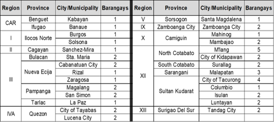
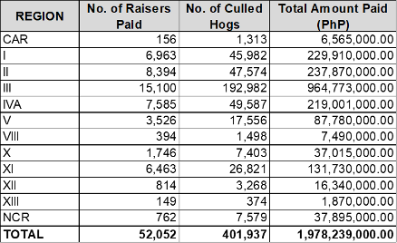

# African Swine Fever

## What is the current status of African Swine Fever (ASF) in the Philippines?

- As of September 8, 2022, ASF has affected 14 regions, 56 provinces, 731 cities and municipalities, and 3,987 barangays.
  - Active cases of ASF were recorded in 27 municipalities in 17 provinces (refer to the next slide for a summary on the number of areas with active cases);
  - Two hundred and three municipalities (203) were upgraded from Red (Infected) Zone to Pink (Buffer) Zone; and
  - Thirty-three (33) municipalities were upgraded from Pink (Buffer) Zone to Yellow (Surveillance) Zone.
- A total of 53 provinces have enacted their respective Executive Orders (EO)/ Local Ordinances adopting DA Administrative Order No. 7, series of 2021 otherwise known as the Bantay ASF sa Barangay Program.
- The table below shows the number of areas with active cases as of September 8, 2022:

## What is the government strategy in managing, containing, and controlling the ASF?

- 1-7-10 Protocol - used in controlling the spread of ASF in an area proven to have the disease infection (as supported by laboratory evidence). The protocol establishes the following:
  - <u>Quarantine zone</u> - an area set within 1 km radius from the infected farm to contain infection by limiting animal movement and employing mandatory test and culling of all infected animals;
  - <u>Surveillance zone</u> - an area set within 7 km radius to detect the extent of the infection through surveillance activities and disease reporting, and to limit the movement of live animals, animal products, and by-products. Every movement outside this zone requires veterinary health certificates and shipping permits; and
  - <u>Control zone</u> - an area set at 10 km radius to detect infection at an early stage through mandatory disease reporting.
- Control measures done in the affected areas wherein suspected pigs with disease are culled, removed, buried, and disinfected.
- Disposal of the dead and sick pigs - the Provincial Veterinary Office and Local ASF Task Force identify the sites, then excavate, bury, and disinfect the burial grounds.

## What are the other activities needed in support to the management and control of the disease?

- **Deployment of ASF Vaccine.** The vaccine for ASF is still in the research and development stage, and the BAI, through funding support from the DA-National Livestock Program (DA-NLP), has allocated PhP 100M in the FY2023 budget for the procurement and distribution of ASF vaccines once these have been approved for use and public bidding;
- **Implementation of the National African Swine Fever Prevention and Control Program**. With an allocation of PhP 200.64 million in FY 2023, the Program will undertake activities such as: disease investigation, surveillance, and monitoring; conduct of laboratory tests; and issuance of ASF-Free Status Certificate; and 
- **Continuous Information and Education Campaign**.

## What is the status of the ASF Indemnification Program?

- It should be noted that Indemnification thru the DA Quick Response Fund (QRF) has already ended last June 30, 2021,[^1] and that Indemnification from July 1, 2021 to present is under the Philippine Crop Insurance Corporation (PCIC).
- A total amount of PhP 1.98 billion worth of indemnification was paid to 52,052 hog raisers from 401,937 hogs culled nationwide as of June 13, 2022 (refer to the table in the next slide for regional disaggregation).

## What are the alternative livelihoods for the ASF-affected farmers?

- **Implementation of sentinel protocol**. The protocol consists of providing animals (as sentinels), feeds, and biologics sufficient to grow the animals for up to 40 days.
  - For FY 2022, the DA allocated PhP 892 million for the sentinel program. As of August 30, 2022, 15,171 piglets or 28% of the 53,550 annual target have been distributed.
  - For FY 2023, total of PhP 513 million allocation has been proposed for the sentinel program to facilitate the distribution of 17,802 piglets to 5,934 ASF-affected hog raisers.
  
- **Community-Based Swine Production thru Clustering and Consolidation Project**.
  - For FY 2022, PhP 2.6 billion was allocated for this Project. As of August 30, 2022, 346 FCA-beneficiaries have been awarded the project, valued at PhP 1.8 billion. Some of these are for fund transfer while others have commenced the construction of facilities. The remaining balance correspond to projects still at the pre-implementation stage, owing to ongoing CSO accreditation and completion of documentary requirements. These are targeted to be obligated before the end of the 3rd Quarter of 2022.
  - For FY 2023, the NLP proposed a total of PhP 2.48 billion for the Project for the establishment of 206 biosecure and climate-controlled swine facilities for the benefit of 206 FCA-beneficiaries.

- **Distribution of livestock multiplier farm modules.**
  - Under FY 2022, the NLP allocated several alternative livestock multiplier farm modules (e.g., cattle, chicken, duck, and other small ruminants) with a total allotment of PhP 178 million.
    - As of August 30, 2022 a total of 26 modules were already transferred to 26 farmer cooperative associations (28% of the 90 modules targeted).
  - For FY 2023, the Program is proposing a total of PhP 188.13 million for the Livestock Economic Enterprise Development (LEED) Project targeting 100 modules.

- For FY 2023, the NLP proposes the continuation of the LEED and the INSPIRE (Integrated National Swine Production Initiatives for Recovery and Expansion) Projects to help ASF-affected farmers.
  - For INSPIRE, the Program proposed PhP 4.2 billion, of which 71.14% (or PhP 2.99 billion) shall be allocated for ASF-affected hog raisers.

[^1]: This is based on DA Memorandum dated 14 June 2021, in which all hogs depopulated from 1 October 2020 to 30 June 2021 will be accommodated under the DA QRF, and that hog raisers are encouraged to apply for insurance of their hogs to the PCIC.
