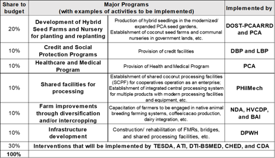
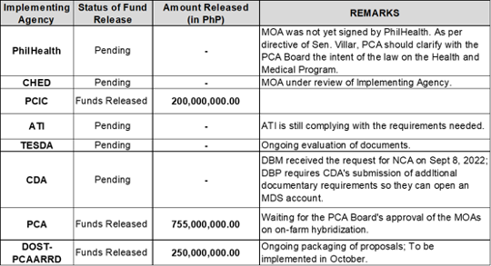
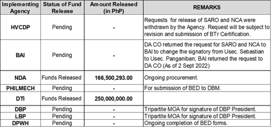

# Coco Levy Fund

## What are the salient features of the Republic Act 11524 or the Coconut Farmers and Industry Trust Fund Act?

- Beneficiaries of the Coconut Farmers and Industry Trust Fund Act are:
  - Owner-cultivators of coconut farms not more than 5 hectares in size;
  - Owners of coconut farms not more than 5 hectares in size who do not till the land but have control and supervision over the cultivation of these same coconut farms;
  - Leaseholders with not more than 5 hectares of coconut farms, or tenants who till or supervise the cultivation of the coconut farm; and
  - A farm worker or laborer, whether seasonal or itinerant, engaged in the harvesting of the nuts and processing of copra as means of livelihood.
- The Coconut Farmers and Industry Development Plan (CFIDP) shall be formulated by the Philippine Coconut Authority (PCA). Said Plan has been approved by the President on June 2, 2022 pursuant to EO 172, series of  2022;
- Programs related to planting, replanting, fertilization, research and development, market promotion, and farm-to-market roads in coconut-producing provinces shall also be funded through regular appropriations of PCA;
- Within 120 days upon effectivity, the PCA Governing Board shall enter into a Memorandum of Agreement (MOA) with the DOST-PCAARRD, TESDA, ATI, NDA, PHilMech, CDA, LBP, DBP, CHED, DTI, and DPWH to ensure a coordinated implementation of programs under the development plan, proper utilization of the allocations, and submission by these agencies of periodic accomplishment report to the PCA Board;
- Completion of the Coconut Farmers Registry by PCA and an annual verification of the registry to be conducted by the LGUs in coordination with PCA and DA.  As of September 15, 2022, there are about 3.55 million farmers registered in the system;
- Creation of the Coconut Farmers and Industry Trust Fund which shall be maintained for 50 years under the CFIDP and shall be used for the benefit of the coconut farmers and the development of the coconut industry;
- Reconstitution and strengthening of PCA Board to ensure the participation of coconut farmers in the crafting and implementation of the CFIDP. The composition of the PCA Board is amended as follows: DA as the Chairperson, DOF as the Vice Chairperson and DBM, DOST, DTI, PCA, and three (3) representatives from the coconut farmers sector (one from each island group) as members. The PCA Board exercises all the corporate powers and responsibilities of PCA and is responsible in providing guidance on policy and major decisions of PCA;
- Creation of a Trust Fund Management Committee comprising of authorized representatives from DOF, DBM, and DOJ to be responsible for setting the Investment Strategy of the Trust Fund. The Bureau of Treasury (BTr) shall act as the Secretariat and shall maintain records and accounts of all investments, receipts, disbursements and other transactions related to the Trust Fund;
- Immediately upon the enactment of this Act, the BTr shall transfer PhP 10 billion to the Trust Fund and the following amounts in the succeeding years:
  - Second year: PhP 10 billion;
  - Third year: PhP 15 billion;
  - Fourth year: PhP 15 billion;
  - Fifth year: PhP 25 billion; and
  - Any amount accrued, including interest, in the special account in the general fund to the Trust Fund.
- Any amount of the Trust Fund Income shall be released directly to the implementing agencies, which shall be utilized in accordance with the Development Plan for a period of fifty (50) years: provided that the amount shall not be lower than PhP 5 billion for any given year.

## What are the interventions that will be provided under RA 11524?

- The following are the major PAPs that will be implemented under the law and their respective percentage share in the budget allocation:

# How many are the potential coconut farmer-beneficiaries of the CFITF per province?

- An approximate of 960,815 eligible coconut farmer-beneficiaries will benefit from the Coconut Farmer and Industry Trust Fund with the following breakdown per region:

## What is the status of the release of funds under the program?

- The status of fund release for each implementing agency are as follows (as of September 15, 2022):

