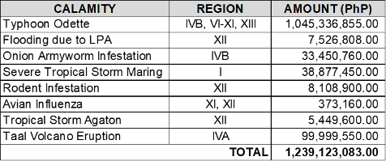

# Damages to Agriculture and Fisheries

## What is the total extent of damage to the Agriculture and Fisheries sector from 2015 to the 1st semester of 2022?

- From 2015 to June 2022, the agri-fisheries sector suffered damages on various commodities in 6.08 million hectares of area, with a total of 9.63 million metric tons of production losses valued at PhP 180.44 billion. (Table 1 in the next slide details the annual damages to the sector).

Table 1. Value of Damages to the agri-fishery sector from 2015 to June 2022:

## What is the Quick Response Fund (QRF) utilized for?

- According to the FY 2022 GAA, the QRF shall serve as a standby fund to be used for:
  - provision of various production inputs for crops, livestock and poultry, and fisheries;
  - repair of production, post-production, and small-scale irrigation facilities; and
  - provision of other assistance in the form of cash for culled live animals or necessary tools and supplies directly used to mitigate the effects of an ongoing disaster.

- For FY 2022, PhP 1 billion of QRF was appropriated for the DA.
  - By March, about 99.98% had been allocated for Typhoon Odette across eight (8) regions.
  - From this, the Department requested for the replenishment of the QRF and was granted another PhP 1 billion.
  - Table 2 in the next slide details the fund releases from the FY 2022 QRF as of July 31.

Table 2. FY 2022 Quick Response Fund (QRF) releases as of July 2022:

## What are the gaps and challenges encountered in funding and implementation of the rehabilitation and recovery programs, projects, and activities?

- The annual QRF allocation of PhP 1 billion is severely insufficient given that the average annual damage and losses for agriculture and fisheries from 2007 to 2021 is PhP 25.77 billion.
  - Due to the limited amount of QRF, most of the PAPs funded cover **totally** damaged areas only.
- The request for cash-for-work (CFW) allocation likewise cannot be accommodated under QRF due to the special provision stating that the fund can only be utilized for the provision of cash assistance for culled live animals.
- Also, funds are inadequate for logistics and other program management expenses incurred during the implementation of rehabilitation and recovery interventions.
