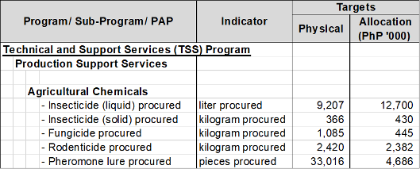

# Fall Armyworm (FAW)

## How much damage was caused by FAW to corn areas?

- The Fall Armyworm (Spodoptera frugiperda) is a lepidopteran pest which feeds on a large number of leaves and stems, causing major damage to corn and 353 other species of crops. The first incidence of Fall Armyworm (FAW) in the Philippines was reported on June 20, 2019 at Piat, Cagayan.
- From 2019 to July 2022, FAW has devastated a total of 49,231.74 hectares.
- As of July 28, 2022, a total area of 9,752 hectares nationwide are infected by FAW with an average infestation rate of 20.06%. This area is equivalent to 1.82% of the country’s total standing crop for corn. Despite this low percentage, the National Corn Program (NCP) is ensuring that infected areas are immediately managed to prevent further damage to crops.
  - Of this total infected area, 9,746 ha or 99.94% have been treated.
  
## What are the activities included in the FY 2023 proposal in further support to FAW management?

- The NCP will procure agricultural chemicals (specifically, insecticides and pheromone lures) for distribution to farmers to help in managing insect pests including FAW. The FY 2023 physical targets and corresponding amounts are:

