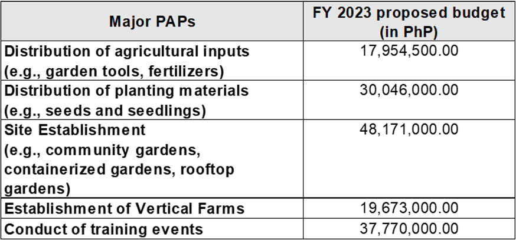

# National Urban and Peri-urban Agriculture Program (NUPAP)

## Does the National Urban and Peri-Urban Agriculture Program (NUPAP) have the budget to implement urban agriculture? 

- As a newly-created Banner Program of the DA, formalized through Administrative Order No. 3, series of 2022, the budget of NUPAP shall be proposed beginning FY 2023. 
- Currently, the Program is operating through the provisions of DA agencies such as the Bureau of Plant Industry, High Value Crops Development Program, Agricultural Training Institute, and DA RFOs. The packet of seeds and seedlings by NUPAP was provided by UPLB-IPB and other external funding from partners. 

## Why is Urban Agriculture (UA) elevated as a new banner program of the DA? How is it different from the HVCDP? 

- UA has been seen as an alternative approach to address food security, especially in the midst of population growth, increasing urbanization, food price volatility, issues in logistics, limited agricultural lands, effects of climate change, and extreme calamities.
- It represents an opportunity for improving food supply, health conditions, local economy, social integration, and environmental sustainability altogether. 
- NUPAP focuses on lowland vegetables crop production, inclusion of small livestock (e.g., rabbit and chicken), herbs, and spices and ornamentals, whereas the HVCDP focuses on “high value” crops which include those with export market such as banana, mango, and pineapple, as well as industrial/ plantation crops (e.g., coffee, cacao, and rubber).
- The NUPAP’s interventions are also focused on rehabilitating urban and peri-urban cities through urban farming and local food production.

## Who are the target beneficiaries of NUPAP or those who can avail of project interventions? 

- One of the program strategies of NUPAP for UA implementation is collaborating with NGAs, LGUs, SUCs, the private sector, NGOs, and international bodies in coordination with RFOs and other program implementers in order to build program sustainability.
- However, any entity expressing interest to engage in UA may avail of the interventions. Partners may also enter into a MOA for a UA project. Beneficiaries could come from households, the urban poor, LGUs, NGAs, Homeowners Associations/ Communities, FCAs, CSOs, business enterprises, or the private sector. 
- For FY 2023, areas with the highest share in the NUPAP’s proposed budget are NCR and Regions IVA, VII, and XI. 

## What are the activities under NUPAP? 

Below are some of the major PAPs to be implemented by NUPAP in FY 2023:

There are other activities that are envisioned to be implemented by the NUPAP (such as the establishment of corporate farms for commercial scale and establishment of urban and peri-urban Agriculture Technology and Training Centers); however, some of these were not included in the FY 2023 proposal due to ongoing firming-up of the Program’s thrusts and priorities.

## What are the training courses or topics conducted under UA?

- Training events cover topics such as on:
  - Urban Gardening;
  - Small Livestock (Rabbit & Chicken Raising);
  - Hydroponics; 
  - Vertical Farms; 
  - Beekeeping and Honey Production; and
  - Promotion of Good Agricultural Practices (GAP) and food safety in UA local produce.
