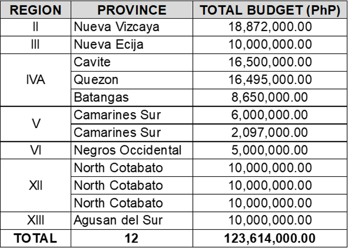

# National Organic Agriculture Program (NOAP)

## How is NOAP addressing the difficulty in securing organic certification?

- The Participatory Guarantee System (PGS) certification is implemented as an alternative to the 3rd party certification for small farmers.  PGS refers to a locally-focused quality assurance system which is developed and practiced by those engaged in organic agriculture.  It is built on a foundation of trust, social network, and knowledge exchange, and is used to certify producers and farmers as actual and active practitioners of organic agriculture.
- NOAP is providing a monetary incentive of PhP3,000/farm certified by a PGS Organic Certifying Body (OCB).  A PGS OCB must be certified and accredited by the Bureau of Agriculture and Fisheries Standards (BAFS).  After which, it is allowed to certify other organic farm members within their PGS group.
- PGS OCBs and PGS certified farms will also be prioritized in the assistance to be provided by NOAP to encourage other organic practitioners to secure organic certification.

## How does NOAP contribute to the reduction in production cost amidst rising cost of synthetic fertilizers?
NOAP supports community-based production of organic/compost fertilizers through the following:
- **Establishment of Organic Agriculture (OA) Hubs** – An OA Hub is envisioned as a one-stop shop that integrates businesses in a value chain from the production and supply of organic inputs such as fertilizers, provision of farm services (including equipment and machinery), provision of technical services, consolidation of harvests, processing and value adding, and marketing and capacity building.  Interventions from the Program include provision of production support, extension and training support, provision of machinery, equipment, and facilities, and small-scale irrigation projects. 
  - For FY 2023, NOAP proposed to establish 12 organic hubs with a total budget requirement of PhP 123.61 million (see next slide for the provincial locations of these targeted facilities).
  - Organic hubs targeted in FY 2023:

- **Establishment of Composting Facility on Biodegradable Waste (CFBW) and Small-Scale Composting Facility (SSCF)** – Through the BSWM, CFBWs and SSCFs are distributed to LGUs, CSOs, and SUCs. These facilities convert biodegradable wastes into organic fertilizers/ compost that could be used by organic agriculture farmers and practitioners in the production of crops such as organic rice, corn, and vegetables.
  - Each CFBW consists of a rotary composter, a shredding machine, as well as on-site demo and training support.  
  - Each SSCF consists of 15 kilos of vermi or African Night Crawler (ANC), shredding machine, and 15 liters of vermi-tea brewer.  
  - For FY 2023, NOAP proposed PhP 97.25 million for the establishment of 91 CFBWs under Tier 1, and PhP 89.1 million for the establishment of 198 SSCFs under Tier 2.

## What is NOAP’s position on the Balanced Fertilization Strategy (BFS)?

- NOAP supports BFS as it promotes utilization and expansion of market for organic fertilizers. It is a gateway for adoption of organic agriculture practices by conventional farmers starting with the use of organic fertilizers, which can help them reduce production costs.
- However, simply adopting the BFS is not considered by NOAP for conversion of farming lands into OA areas.  A major challenge is to ensure that organic fertilizers are available and accessible to all.  Hence, NOAP proposes for continued assistance and interventions for organic fertilizer production.
- Thus, to strengthen promotion on the production and use of organic fertilizers, the Program, aside from implementing the establishment of composting facilities, allocated funds amounting to PhP 29.6 million to cover activities such as distribution of African Night Crawlers (ANC) and molasses which are essential fertilizer inputs. 

