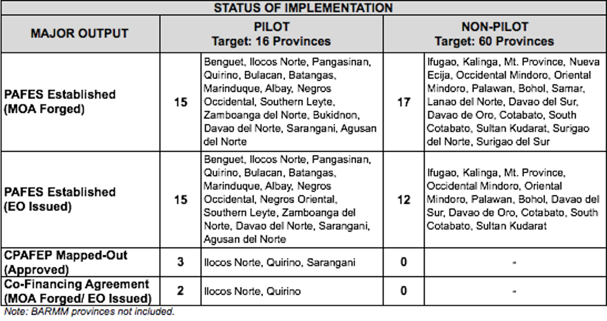

# Province-led Agriculture and Fisheries Extension System (PAFES)  

## What is PAFES?

- PAFES was introduced in 2020 with the main goal of pursuing a systematic and strategic approach in forging strong and sustained partnerships with LGUs, SUCs, private sectors, farmers’ and fishers’ groups, and other national government agencies in provinces. 
- PAFES shall integrate DA operations in the provinces to spearhead agricultural modernization and industrialization, enhance rural livelihoods through the massive utilization of science-based innovations, and catalyze the establishment of robust agro-based enterprises.

## What will be the source of funds in the implementation of PAFES?

- For the DA’s part (including that of its attached agencies), its share to the co-investment will be sourced from the budget of the regular programs and tagged as PAFES. LGUs will source its share from its IRA. 
- Other partner stakeholders can also commit certain funds in support to the requirements identified in the Collaborative Province-led Agriculture and Fisheries Extension Programs (CPAFEP). The co-financing agreements among the provincial partners will be carried out through negotiations.

## What will be the source of funds in the implementation of PAFES?

- For the DA part (including attached agencies), its share to the co-investment will be sourced from the budget of the regular programs and tagged as PAFES. LGUs will source its share from its IRA.
- Other partner stakeholders can also commit certain funds in to support the requirements identified in the Collaborative Province-led Agriculture and Fisheries Extension Programs (CPAFEP). The co-financing agreements among the provincial partners will be carried out through negotiations.

## What is the status of the PAFES implementation in the regions?

Below is the status as of July 2022:

